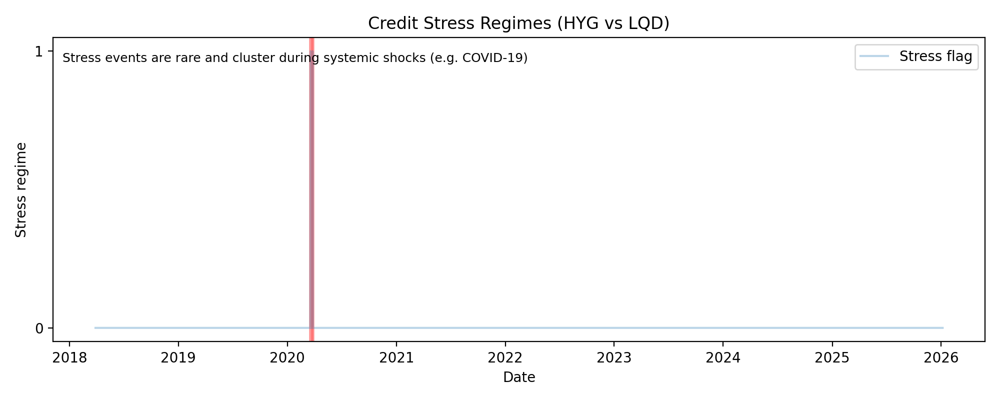

# Credit Regime Detector

A production-style Python project that detects **credit stress regimes** using transparent, desk-aligned signals and evaluates a simple **credit-quality tilt strategy**.

The project focuses on **interpretability, reproducibility, and research hygiene** rather than model optimisation.

---

## Motivation

In stressed markets, high-yield credit tends to underperform investment-grade, volatility rises, and credit becomes more equity-correlated. This project formalises that intuition into a **testable and explainable regime framework**.

---

## Signals Used

- HY vs IG relative returns (HYG − LQD)
- Rolling z-score of relative spread proxy
- Rolling volatility of credit spreads
- Rolling correlation between credit ETFs and equities (SPY)

---

## Regime Definition

A **credit stress regime** is flagged when:

- Relative HY underperformance is statistically extreme
- Credit spread volatility is elevated
- Credit–equity correlation increases

The rules are intentionally **simple and explainable**, reflecting how traders reason about stress conditions.

---

## Strategy Example

A toy LQD–HYG relative value strategy is evaluated:

- **Risk-on:** Long LQD, short HYG
- **Risk-off:** Flat exposure during detected stress regimes

Performance metrics include:

- Total return  
- Maximum drawdown  
- Sharpe ratio  

This strategy is included to demonstrate **end-to-end signal usage**, not to maximise performance.

---

## Engineering Features

- Deterministic, reproducible feature pipeline
- Offline-safe testing (unit vs integration separation)
- Parquet-based data caching
- Continuous Integration via GitHub Actions

---

## Outputs

Running the `python main.py` produces the following files in `outputs/`:

- `features.csv`
- `stress_flags.csv`
- `strategy_returns.csv`
- `strategy_summary.csv`
- `stress_indicator.png`

---

## Example Strategy Output

Example output from a single run:

| Metric        | Value  |
|---------------|--------|
| Total Return  | -8.7%  |
| Max Drawdown  | -27.0% |
| Sharpe Ratio  | -0.10  |

> **Note:** Results are intentionally **not optimised** and are presented to illustrate pipeline behaviour rather than investment performance.

## Credit Stress Regime Visualisation

*Binary credit stress indicator highlighting periods of HY underperformance and elevated cross-asset risk (e.g. COVID shock).*

---

## Design Decisions and Caveats

- Explainable signals were prioritised over machine learning to retain interpretability.
- Explicit regime rules allow behaviour to be reasoned about during historical stress events.
- Offline-safe tests ensure CI reliability while isolating network dependencies.
- Outputs are reproducible and separated from source code to mirror production research workflows.

---

## Possible Extensions

- Alternative credit stress definitions (e.g. CDX, OAS-based proxies)
- Dynamic thresholding by volatility regime
- Multi-asset defensive overlays
- Parameterised backtesting framework
